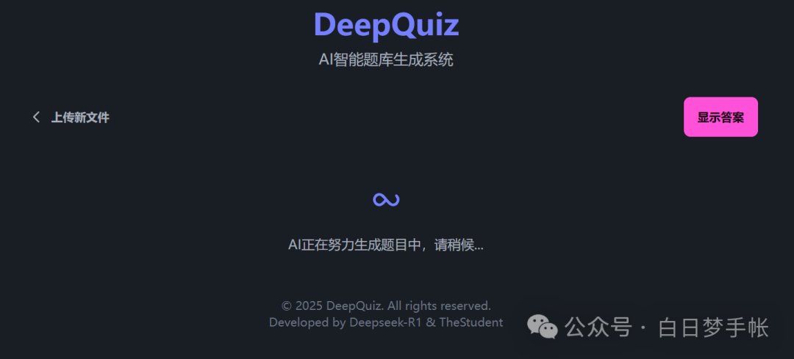
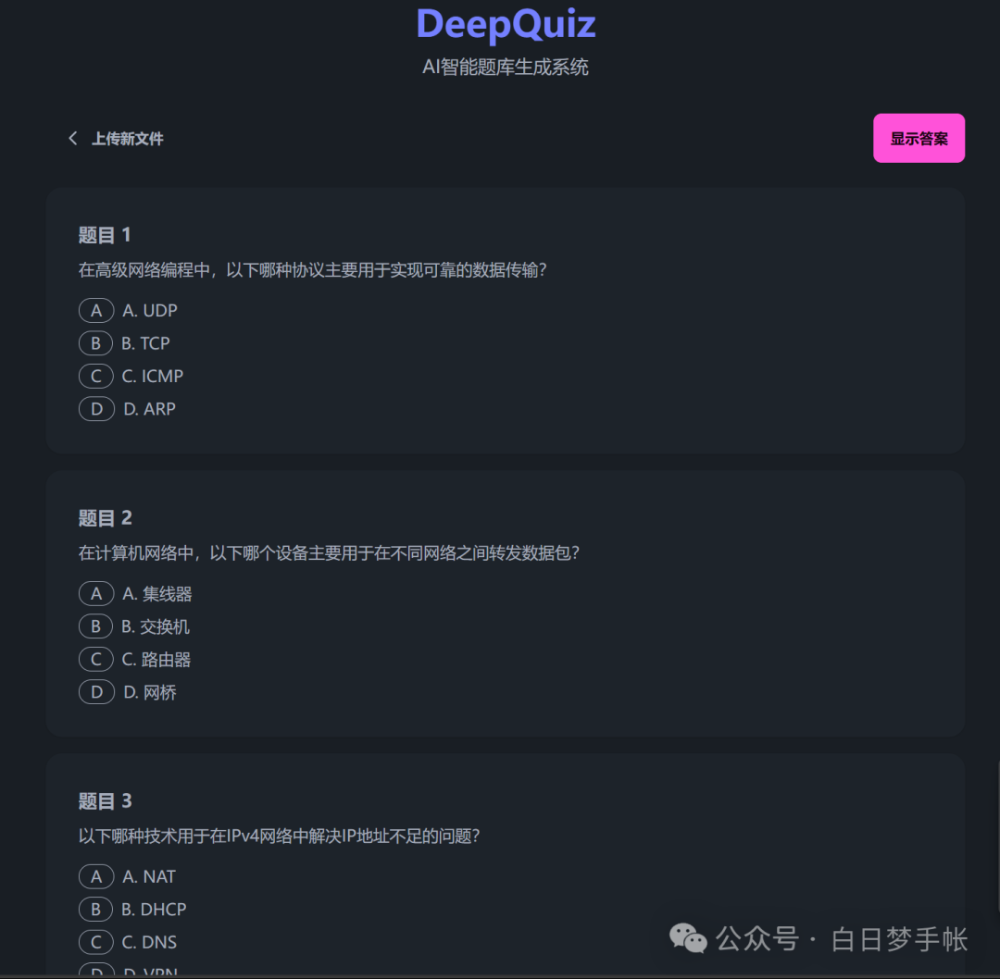

# DeepQuiz

🚀完全由Deepseek-R1开发的AI试题生成应用，根据用户自上传的PDF文档生成练习题，可自定义题数、难度和题型等。Just4Fun😋

与AI的对话记录全部保存于chat_history目录下

### 应用界面






### 部署教程

#### 后端部署
```bash
# 安装所需库
pip install fastapi uvicorn python-multipart pymupdf requests sqlalchemy

# 启动
uvicorn main:app --reload

# 测试
curl -X POST -F "file=@/path/to/file.pdf" -F
```

#### 前端部署
直接访问src/frontend/index.html即可

### 开发细节
开发过程及技术细节详见：[【实战】让Deepseek-R1自己开发一个AI应用，有多难？](https://mp.weixin.qq.com/s/MfRcGOHIdj-ZckKGNgk7-Q)

### 创作声明
本应用几乎所有代码均由deepseek-R1模型编写，其中人为改动的部分均有注释标注，本应用开发目的意在测评R1模型的编程开发能力。

本仓库所有权和最终解释权归属于北京邮电大学黎享卓越科创工作室-TheStudent

### Star History


